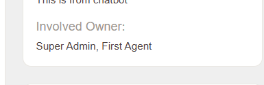

# Znuny Ticket Owner List
- Populate previous and current ticket owner in dynamic field.
- Based on Znuny 7.0.x

1. Create a DynamicField

		Name: Anything (E.g: InvolvedOwner)
		ObjectType = Ticket
		FieldType = Text
		
2. Update Admin > System Configuration > Ticket::EventModulePost###3120-TicketOwnerList

		DynamicField = As per no 1. (Default: InvolvedOwner)
		
		
